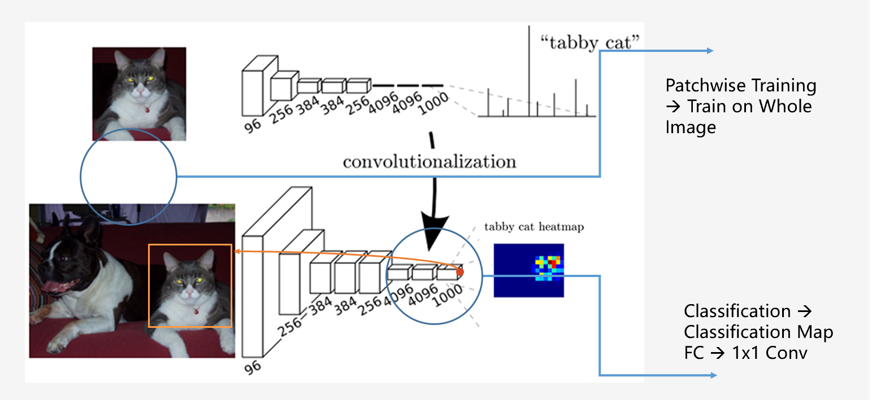
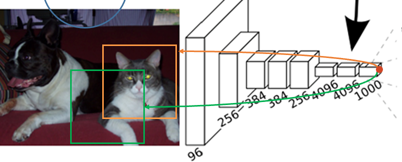
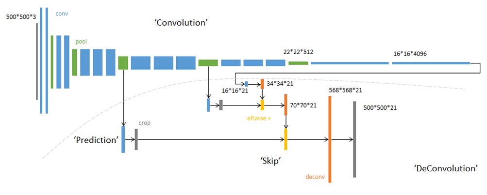
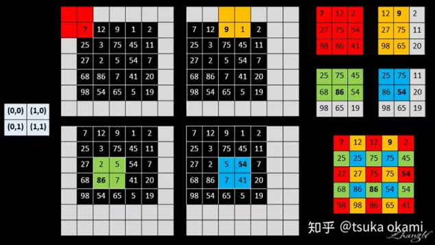
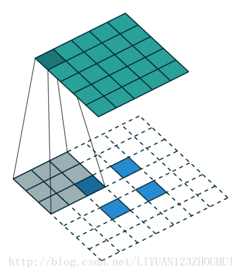

# FCN

## Motivation

* 2014年时，CNN已经在分类(classification)，检测(detection）上有重大进展，下一步自然是语义分割（segmentation）上的运用
* 相比之下以前方法很依赖数据的前后处理，CNN是end-to-end的特性有十分诱人的前景

## Contribution

### 提出FCN，将 Classification CNN 转为 Dense Prediction  网络

语义分割网络和分类网络有相似之处：都是对感受野内input进行分类。只是Dense Prediction网络进行的时pixel wise prediction, 其输出是一张classification map.

针对此，作者做出两个改动：

1. 从原来patchwise training 改为 在整张图上一次训练(Train on Whole Image).
2. 由于得到的是二维输出，所以FC层无法使用。可以用1x1的卷积核代替FC将像素的特征向量降维到分类logit。

此外，改动1）能大大提高运算效率，如图所示：

可以证明，在loss是逐个输出像素上分别计算的情况下，Train on whole image 等价于 将每个输出像素对应的Reception Filed均当作一张张patch，组成一个mini patch进行训练。

但如果以patch wise的形式训练，reception filed间的重叠部分会被重复计算（如图中的橙，绿交叠部分），而whole image training只需要计算一次。是故感受野重叠越多，whole image training性能优势越大。

文中对这点说得比较简略，结论主要用实验表明。可以画个一维情况，很容易看出二者的不同。

### 提出跳级连接解决 语义信息——位置信息 之间“Tension”

使用DCNN进行语义分割，又会带来新问题：为了提高感受野，在当时的“技术条件下”，只有pooling可以选择。但是pooling势必会造成随着网络加深，抽象的语义信息被提取的同时，位置信息逐渐损失（文中叫coerce)。或者说全局信息（语义）和位置信息（location）之间存在tension或tradeoff。

作者提出将浅层的特征和upsampling后的深层特征结合起来（逐点相加），从而克服DCNN输出分辨率小，无法很好还原位置信息的问题。

文中叫做跳级连接，Deeplab中称之为Multi-Scale。概括来说，是一种编码器——解码器结构。

## Discussion

### 尝试：Shift and Stitch

作者曾经尝试过用一种叫Shift and Stitch的办法避免尺寸减少的发生。这个算法不好描述，论文中讲得也不算清楚。

我们可以给出一种等效的解释：

1. 输出尺寸缩小，是因为输出的感受野在input上stride>1,如stride=32，则尺寸缩小32倍。
2. 该算法通过shift input，使得网络在input的等效步长为1，从而实现分辨率不降低。

通过一些简单的分析，我们还可以发现该算法可以用带洞卷积+带洞maxpooling等效实现(即deeplab中所说的atrous算法，原为法文）。

不过作者声称自己“做了初步的实验”，就认为该方法不如上采样来的effective&efficient。这恐怕难以苟同。事实上，不带CRF的Deeplab的Conv5，就刚刚好实现了Shift&Stitch算法，且取得了类似FCN的成绩。

作者没有就该方法上探讨下去，恐怕是应为当时atrous算法需要的带洞卷积还没有加入Caffe。而算法的原始形式计算量又太大。后来DeepLab自己写了个带洞卷积，就沿着这个思路做出了不错的成果。

该算法还是有一些启发意义的，作者提到对输入做随机shift，可以作为数据增强手段，还取得了不错的结果。

### 上采样的方法

FCN同时采用了反卷积和双线性插值两种方法进行上采样。在最终发布的代码中，全部采用双线性插值，并解释”二者性能没有什么不同“

但FCN似乎总是被误解用的是反卷积（Deeplab作者就认为FCN就是因为反卷积用太多，造成网络训练过慢）。

这可能是应为FCN采用了一种巧妙的方法，用固定常数的卷积核反卷积（可以证明反卷积等价于对input0插值后卷积），形成双线性插值效果。所以结构中只看到的反卷积层。这种方法颇为有趣，具体可以在surgery.py中看到。

## Experiment

### 实验结果

达到state-of-art

### Ablation Experiment

* 数据指出，加入跳级连接分支可以较大提高IoU，最优结果在加到stride为8的pooling层时达到。
* 数据指出，对loss进行随机sampling（加一个Dropout Mask），等价于对输入patch做采样，不会提高性能，反而会降低收敛速度
* 作者声称，轻微的类别不平衡，用加权loss补偿不会带来显著增益。
* 作者声称，随机mirror核随机shift的数据增强手段大大提升了效果。

## Cook Book

源码网址：https://github.com/shelhamer/fcn.berkeleyvision.org

### Data

* Dataset

  PASCAL VOC2011(主要) SIFT FLOW, PASCAL CONTEXT, NYUD

* Augmentation

  Random Mirror， Random Shift

* Distribution

  实验证明无需处理

### Network

FCN, Finetune from VGG/Googlenet/Alexnet；交叉熵损失；

### 实验框架

### Metric

(frequency weighted)IoU+Mean Pixel Accuracy

## 不足

### 【设计】分辨率损失较大

由于完全依赖pooling来提高感受野，分辨率损失很大。

从upper bond实验可以看到，降采样后重采样地图片最大IOU只有80几个点，可见信息在减采样过程中大量损失。

### 【设计】没有考虑相邻预测点之间的关系

预测结果的点与点之间是可以相互提供信息的，比如周围都是猫像素，那么出现狗像素的机率就很低。该文缺乏对此的考量。

### 【实现】输入图像尺寸任意

尽管FCN支持任意尺寸输入，但似乎按照deeplab那样实现crop更加合理一些，否则：

* batch size不固定
* alignment 不准确（实际实现的候直接图片两侧padding 100，不同尺寸地feature结合地时候，大feature从中心crop到小feature尺寸）。相比之下deeplab代码里，就对alignment做出了精确地计算

