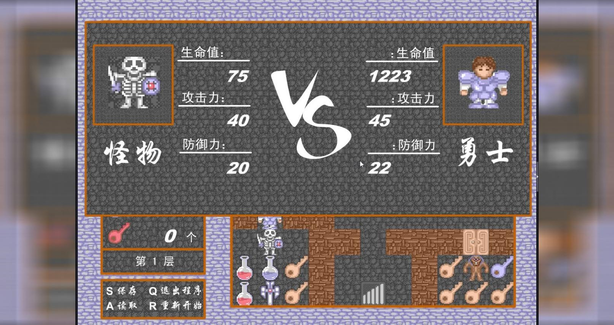
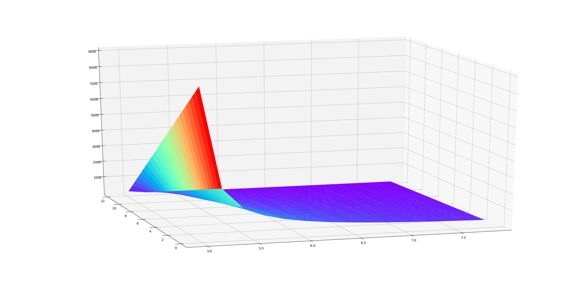

## 前言

魔塔游戏是一个历史悠久的迷宫RPG，自第一个DOS版的魔法の塔，游戏已有二十几年历史，其在中国的生命力极为旺盛，魔改层出不穷。但究其主要内容，不外乎杀死怪物，击败魔王，救出公主。

战斗中，勇士攻击力减去怪物的防御力，是为单回合内勇士给怪物造成的伤害，反之亦然。怪物一旦生命值值降为0，战斗结束，勇士将获得一定的经验与金币，用于提升自己的生命值，战斗力与防御力。

可见，魔塔游戏的一大核心问题，在于科学分配金币和经验，分别用于提高勇士的防御力与攻击力。

以下将给出魔塔游戏的最优防御-攻击力提高办法。

## 求解

我们设勇士损失的生命值为$\Delta L$,以其最小化作为优化目标。大写的$A,D$表示勇士的攻击力与防御力，小写则表示怪物。

小写字母$l$表示怪物的生命值。此时优化问题写为：
$$
min_{A,a,D,d>0} \space \Delta L=\frac{l}{A-d}(a-D)=l\frac{a-D}{A-d} \\
$$
当然，我们不需要考虑勇士无法对怪物造成伤害，或怪物无法对勇士造成伤害的情况。这并不是一个凸优化问题，没有最优解。但通过比较攻击$A$和防御$D$对于受伤$\Delta L$的梯度，求出提高攻击和加强防御，哪一个能够尽可能多地降低受伤：
$$
\frac{\partial \Delta L}{\partial D} = -\frac{l}{A-d} \\
\frac{\partial \Delta L}{\partial A} = -l\frac{a-D}{(A-d)^2} \\
-\frac{l}{A-d} = -l\frac{a-D}{(A-d)^2} \\
A-d = a-D \\
$$

我们按照贪婪算法，每一步都尽可能降低总受伤。

可以得到**结论**，当每回合勇士对怪物的伤害$A-d$小于每回合勇士受伤$a-D$时，应该提高攻击，反之则提高防御。式子中的怪物属性$a$和$d$，可以取决于造成了最多伤害的怪物。

实际游戏时，一种简便方法，是先提高攻击，而把防御控制在攻击之下，且与当前可战斗的怪物中，攻击最高者相等，这也是很多速通视频中的做法。

## 讨论

### 可视化

如图，z轴为总受伤，A轴方向为双曲线，D轴方向为直线。优化中我们先沿着双曲线下降，直到A，D轴梯度相等，再沿着D轴下降。